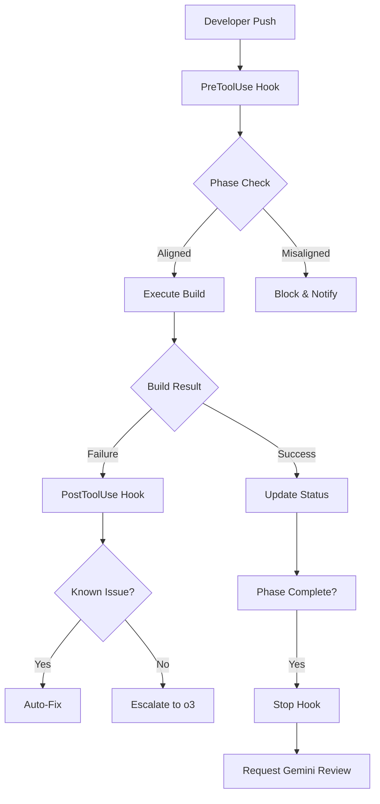

# NeXTRust CI Pipeline: Claude Code-First Architecture

*Last updated: 2025-07-18 16:30*

> **Version:** 2.0 - Modular dispatcher architecture with enhanced robustness

## Overview

The NeXTRust CI pipeline leverages Claude Code's native hook capabilities as the primary orchestration layer, with selective escalation to specialized AI agents (OpenAI o3 for design, Gemini 2.5 Pro for review). This architecture minimizes latency, reduces complexity, and maintains a clear audit trail through structured status artifacts.

## Architecture Principles

1. **Claude Code as Primary Agent**: Handles 90% of decisions locally
2. **Selective Escalation**: Only novel design challenges go to o3
3. **Structured Status Tracking**: Dual-format artifacts (Markdown + JSON)
4. **Hook-Based Orchestration**: No client-side git hooks needed
5. **Idempotent Operations**: Safe for retries and context resets

## Version 2.0 Enhancements

### Modular Dispatcher Architecture
- **Thin Router**: Main dispatcher (`hooks/dispatcher-v2.sh`) reduced to ~30 lines
- **Module Organization**: Clear separation in `hooks/dispatcher.d/`
  - `common/` - Shared utilities (setup, cleanup, metrics, idempotency)
  - `pre-tool-use/` - Pre-execution validations
  - `post-tool-use/` - Failure analysis and status updates
  - `stop/` - Phase completion and review triggers
  - `user-prompt-submit/` - Prompt auditing for token correlation

### Robustness Improvements
- **Composite Idempotency Keys**: `SESSION_ID:COMMIT_SHA:RUN_ID:RUN_ATTEMPT`
- **File Locking**: 5-second timeout with exponential backoff
- **Failure Loop Protection**: Per-commit backoff tracking in `.claude/backoff/`
- **Persistent Failure Tracking**: Database-backed command failure counts
- **Input Validation**: Comprehensive sanitization for slash commands

### Enhanced Integrations
- **ccusage**: Full token usage tracking with cost monitoring
- **Gemini CLI**: Native integration with error handling and fallback
- **O3 Design Service**: Automatic escalation for complex failures
- **Slash Commands**: 11 commands for CI control via PR comments

## Hook Configuration

### `.claude/settings.json`

```json
{
  "hooks": {
    "PreToolUse": [
      {
        "matcher": "Bash",
        "hooks": [{
          "type": "command",
          "command": "./hooks/dispatcher.sh pre",
          "timeout": 90
        }]
      }
    ],
    "PostToolUse": [
      {
        "matcher": "Bash",
        "hooks": [{
          "type": "command",
          "command": "./hooks/dispatcher.sh post",
          "timeout": 300
        }]
      }
    ],
    "Stop": [
      {
        "matcher": "",
        "hooks": [{
          "type": "command",
          "command": "./hooks/dispatcher.sh stop",
          "timeout": 60
        }]
      }
    ]
  }
}
```

### Smart Dispatcher Pattern

The dispatcher examines JSON payloads to avoid triggering expensive operations on every command:

```bash
#!/bin/bash
# hooks/dispatcher.sh - Intelligent hook dispatcher
#
# Purpose: Routes Claude Code hooks to appropriate handlers based on context
# Inputs: Hook type ($1) and JSON payload (stdin)
# Outputs: Logs to .claude/hook-logs/, updates status artifacts
# Usage: Called automatically by Claude Code via settings.json

set -euo pipefail  # Exit on error, undefined vars, pipe failures

HOOK_TYPE=$1
PAYLOAD=$(cat)  # JSON from Claude Code

# Setup logging
LOG_DIR=".claude/hook-logs"
mkdir -p "$LOG_DIR"
LOG_FILE="$LOG_DIR/$(date +%Y%m%d-%H%M%S)-$HOOK_TYPE.log"
exec 1> >(tee -a "$LOG_FILE")
exec 2>&1

echo "[$(date)] Hook dispatcher started: $HOOK_TYPE"

# Extract relevant fields
TOOL_NAME=$(echo "$PAYLOAD" | jq -r '.tool_name // empty')
COMMAND=$(echo "$PAYLOAD" | jq -r '.tool_args.command // empty')
EXIT_CODE=$(echo "$PAYLOAD" | jq -r '.tool_response.exit_code // 0')
SESSION_ID=$(echo "$PAYLOAD" | jq -r '.session_id')

# Idempotency check with runner-specific session files
RUNNER_NAME="${RUNNER_NAME:-local}"
OS_NAME="${GITHUB_JOB:-${OS:-unknown}}"
CPU_VARIANT="${CPU_VARIANT:-default}"
SESSION_DIR=".claude/sessions"
SESSION_FILE="$SESSION_DIR/$RUNNER_NAME-$OS_NAME-$CPU_VARIANT.session"

mkdir -p "$SESSION_DIR"
LAST_SESSION=$(cat "$SESSION_FILE" 2>/dev/null || echo "")
if [[ "$SESSION_ID" == "$LAST_SESSION" ]]; then
    echo "[$(date)] Skipping duplicate session: $SESSION_ID"
    exit 0  # Already processed this session
fi

# Failure loop protection
COMMIT_SHA=$(git rev-parse HEAD)
BACKOFF_FILE=".claude/backoff/$COMMIT_SHA"
if [[ -f "$BACKOFF_FILE" ]]; then
    FAILURE_COUNT=$(cat "$BACKOFF_FILE")
    if [[ "$FAILURE_COUNT" -ge 3 ]]; then
        echo "::error::Commit $COMMIT_SHA has failed $FAILURE_COUNT times. Push new commit to retry."
        exit 1
    fi
fi

case "$HOOK_TYPE" in
    pre)
        # PreToolUse: Validate phase alignment
        if [[ "$COMMAND" =~ "build-custom-llvm.sh" ]]; then
            ./ci/scripts/validate-phase.sh || exit 1
        fi
        ;;
        
    post)
        # PostToolUse: Handle failures
        if [[ "$EXIT_CODE" != "0" ]]; then
            # Increment failure count for this commit
            mkdir -p .claude/backoff
            FAILURE_COUNT=$(cat "$BACKOFF_FILE" 2>/dev/null || echo "0")
            echo $((FAILURE_COUNT + 1)) > "$BACKOFF_FILE"
            
            ./ci/scripts/analyze-failure.sh "$COMMAND" "$EXIT_CODE"
        fi
        ;;
        
    stop)
        # Stop: Trigger reviews if phase complete
        CURRENT_PHASE=$(jq -r .current_phase.id docs/ci-status/pipeline-log.json 2>/dev/null || echo "unknown")
        PHASE_MARKER="artifacts/phase/$CURRENT_PHASE.done"
        
        if [[ -f "$PHASE_MARKER" ]]; then
            ./ci/scripts/request-review.sh
            rm "$PHASE_MARKER"
        fi
        ;;
esac

echo "$SESSION_ID" > "$SESSION_FILE"
```

## Pipeline Workflow

### Phase-Based Execution



### Status Tracking

#### Race Condition Prevention

To prevent parallel jobs from corrupting status artifacts, all updates go through a locked helper:

```python
#!/usr/bin/env python3
# ci/scripts/status-append.py - Thread-safe status updates

import fcntl
import json
import sys
import time
from datetime import datetime
from pathlib import Path

def append_status(entry_type, data):
    """Append to status artifacts with file locking."""
    
    # Paths
    json_path = Path("docs/ci-status/pipeline-log.json")
    md_path = Path("docs/ci-status/pipeline-log.md")
    lock_path = Path(".claude/status.lock")
    
    # Acquire exclusive lock
    lock_path.parent.mkdir(exist_ok=True)
    with open(lock_path, "w") as lock_file:
        fcntl.flock(lock_file.fileno(), fcntl.LOCK_EX)
        
        try:
            # Update JSON
            if json_path.exists():
                with open(json_path) as f:
                    status = json.load(f)
            else:
                status = {"activities": []}
            
            # Add new entry
            entry = {
                "timestamp": datetime.utcnow().isoformat() + "Z",
                "type": entry_type,
                "details": data
            }
            status["activities"].append(entry)
            
            # Write atomically
            tmp_json = json_path.with_suffix(".tmp")
            with open(tmp_json, "w") as f:
                json.dump(status, f, indent=2)
            tmp_json.rename(json_path)
            
            # Update Markdown
            with open(md_path, "a") as f:
                f.write(f"\n- {entry['timestamp']} - {entry_type}: {data.get('message', 'No message')}\n")
                
        finally:
            # Release lock
            fcntl.flock(lock_file.fileno(), fcntl.LOCK_UN)

if __name__ == "__main__":
    append_status(sys.argv[1], json.loads(sys.argv[2]))
```

Usage in hooks:
```bash
python ci/scripts/status-append.py "build_failure" '{"error": "undefined reference", "file": "atomics.c"}'
```

#### Dual-Format Artifacts

**Human-Readable**: `docs/ci-status/pipeline-log.md`
```markdown
# NeXTRust CI Pipeline Status
*Last updated: 2025-01-16 2:00 PM*

## Current Phase: 3 - Rust Target Implementation
- [x] Phase 1: Environment Setup
- [x] Phase 2: LLVM Backend Modifications  
- [ ] Phase 3: Rust Target Specification (IN PROGRESS)
  - [x] Basic target definition
  - [ ] Atomic operations via spinlocks
  - [ ] no_std hello world

## Recent Activities
- 2025-01-16 13:45 - LLVM build succeeded with Mach-O support
- 2025-01-16 13:52 - Starting atomic spinlock implementation
- 2025-01-16 14:00 - Build failure: undefined _sync_val_compare_and_swap
```

**Machine-Readable**: `docs/ci-status/pipeline-log.json`
```json
{
  "current_phase": {
    "id": "phase-3",
    "name": "Rust Target Implementation",
    "status": "in_progress",
    "expected_files": [
      "rust/compiler/rustc_target/src/spec/m68k_next_nextstep.rs",
      "rust/library/core/src/sync/atomic.rs",
      "compiler-rt/lib/m68k/atomic_spinlock.c"
    ]
  },
  "activities": [
    {
      "timestamp": "2025-01-16T14:00:00Z",
      "type": "build_failure",
      "details": {
        "error": "undefined reference to __sync_val_compare_and_swap",
        "escalated_to": "o3",
        "ticket_id": "design-001"
      }
    }
  ]
}
```

### Phase Schema

```json
{
  "phases": [
    {
      "id": "phase-1",
      "name": "Environment Setup",
      "expected_duration_days": 2,
      "deliverables": [
        "MCP configuration",
        "Development environment"
      ],
      "success_criteria": [
        "MCP server responds to queries",
        "Build tools installed"
      ]
    },
    {
      "id": "phase-2", 
      "name": "LLVM Backend Modifications",
      "expected_duration_days": 5,
      "deliverables": [
        "Mach-O support for m68k",
        "Relocation handling"
      ],
      "success_criteria": [
        "LLVM builds successfully",
        "Can emit valid Mach-O objects"
      ]
    }
  ]
}
```

## Build System Integration

### GitHub Actions Configuration

```yaml
name: NeXTRust CI
on: [push, pull_request]

jobs:
  build-matrix:
    strategy:
      matrix:
        os: [ubuntu-latest, macos-latest]
        rust_profile: [debug, release]
        cpu_variant: [m68030, m68040]
      fail-fast: false
    
    runs-on: ${{ matrix.os }}
    env:
      O3_ENDPOINT: ${{ secrets.O3_ENDPOINT }}
      GEMINI_ENDPOINT: ${{ secrets.GEMINI_ENDPOINT }}
      O3_TOKEN: ${{ secrets.O3_TOKEN }}
      GEMINI_TOKEN: ${{ secrets.GEMINI_TOKEN }}
    
    steps:
      - uses: actions/checkout@v4
      
      - name: Setup Claude Code Environment
        run: |
          # Ensure hooks are executable
          chmod +x hooks/dispatcher.sh
          chmod +x ci/scripts/*.sh
      
      - name: Log Build Start
        run: |
          echo "::group::Matrix Configuration"
          echo "OS: ${{ matrix.os }}"
          echo "Profile: ${{ matrix.rust_profile }}"
          echo "CPU: ${{ matrix.cpu_variant }}"
          echo "::endgroup::"
          
          python ci/scripts/status-append.py "build_start" \
            '{"matrix": "${{ matrix.os }}-${{ matrix.rust_profile }}-${{ matrix.cpu_variant }}"}'
      
      - name: Build LLVM
        run: |
          # Thin runner - Claude Code handles intelligence
          ci/scripts/build-custom-llvm.sh \
            --cpu-variant ${{ matrix.cpu_variant }}
      
      - name: Build Rust Target
        run: |
          cargo build \
            --target m68k-next-nextstep \
            --profile ${{ matrix.rust_profile }} \
            --features ${{ matrix.cpu_variant }}
      
      - name: Upload Artifacts
        uses: actions/upload-artifact@v4
        with:
          name: build-${{ matrix.os }}-${{ matrix.rust_profile }}-${{ matrix.cpu_variant }}
          path: |
            target/m68k-next-nextstep/${{ matrix.rust_profile }}/*.mach-o
            build-logs/*.log
      
      - name: Update GitHub Checks
        if: always()
        run: |
          ci/scripts/github-checks-update.sh \
            --status "${{ job.status }}" \
            --phase "$(jq -r .current_phase.id docs/ci-status/pipeline-log.json)" \
            --matrix "${{ matrix.os }}-${{ matrix.rust_profile }}-${{ matrix.cpu_variant }}"
          
          # Record artifact hashes for traceability
          if [[ "${{ job.status }}" == "success" ]]; then
            HASH=$(sha256sum target/m68k-next-nextstep/${{ matrix.rust_profile }}/hello-world.mach-o | cut -d' ' -f1)
            python ci/scripts/status-append.py "artifact_hash" \
              '{"file": "hello-world.mach-o", "hash": "'$HASH'", "matrix": "${{ matrix.os }}-${{ matrix.rust_profile }}-${{ matrix.cpu_variant }}"}'
          fi

  # Parallel phase execution
  emulator-setup:
    runs-on: ubuntu-latest
    # This can run in parallel with build
    needs: []  
    
  rust-std-port:
    runs-on: ubuntu-latest
    # Only depends on successful basic target
    needs: [build-matrix]
    if: contains(needs.build-matrix.result, 'success')
```

### Claude Code Execution

When Claude runs build commands, the hooks automatically:

1. **PreToolUse**: Validate changes align with current phase
2. **During execution**: Stream output, update status
3. **PostToolUse**: Analyze failures, potentially escalate
4. **Stop**: Trigger reviews when phase completes

## Technical Implementations

### Improved Spinlock Atomics

Based on review feedback, implement per-word lock table instead of global lock:

```c
// compiler-rt/lib/m68k/atomic_spinlock.c
// Per-word spinlock implementation for better performance

#define SPINLOCK_COUNT 64
#define CACHE_LINE_SIZE 16

// Cache-line padded spinlocks to avoid false sharing
typedef struct {
    volatile int lock;
    char padding[CACHE_LINE_SIZE - sizeof(int)];
} __attribute__((aligned(CACHE_LINE_SIZE))) padded_spinlock_t;

static padded_spinlock_t atomic_locks[SPINLOCK_COUNT];

// Hash pointer to lock index
static inline int get_lock_index(void *ptr) {
    uintptr_t addr = (uintptr_t)ptr;
    return (addr >> 2) & (SPINLOCK_COUNT - 1);
}

int __sync_val_compare_and_swap_4(int *ptr, int oldval, int newval) {
    int lock_idx = get_lock_index(ptr);
    padded_spinlock_t *lock = &atomic_locks[lock_idx];
    
    // Acquire spinlock
    while (__sync_lock_test_and_set(&lock->lock, 1)) {
        while (lock->lock) ; // spin
    }
    
    // Perform CAS
    int current = *ptr;
    if (current == oldval) {
        *ptr = newval;
    }
    
    // Release spinlock
    __sync_lock_release(&lock->lock);
    
    return current;
}
```

### External Agent Integration

#### Design Escalation to o3

```bash
#!/bin/bash
# ci/scripts/request-design.sh

request_o3_design() {
    local context=$1
    local error=$2
    
    # Check if we've seen this before
    if grep -q "$error" docs/ci-status/known-issues.json; then
        echo "Known issue - applying standard fix"
        return 0
    fi
    
    # Prepare design request
    local request=$(cat <<EOF
{
  "context": "$context",
  "error": "$error", 
  "phase": "$(jq -r .current_phase.id docs/ci-status/pipeline-log.json)",
  "existing_attempts": $(jq --arg err "$error" '.activities | map(select(.details.error == $err)) | length' docs/ci-status/pipeline-log.json)
}
EOF
)
    
    # Call o3 API
    response=$(curl -s -X POST "$O3_ENDPOINT/design" \
        -H "Authorization: Bearer $O3_TOKEN" \
        -H "Content-Type: application/json" \
        -d "$request")
    
    # Log decision using status-append.py for thread safety
    python ci/scripts/status-append.py "design_decision" \
        "{\"request\": $request, \"response\": $(echo "$response" | jq -c .)}"
}
```

#### Implementation Review by Gemini

The pipeline uses the Gemini CLI for code reviews, with automatic fallback to API if CLI is not available:

```bash
#!/bin/bash
# ci/scripts/request-review.sh

request_gemini_review() {
    # Get current phase and changed files
    local phase_id=$(jq -r '.current_phase.id' docs/ci-status/pipeline-log.json)
    local changed_files=($(git diff --name-only origin/main...HEAD))
    
    # Check if Gemini CLI is available
    if command -v gemini &> /dev/null; then
        # Use CLI with @path syntax for efficient file inclusion
        local prompt_file=$(mktemp)
        cat > "$prompt_file" <<EOF
Please review the following changes for phase: $phase_id

Changed files:
$(for f in "${changed_files[@]}"; do echo "@$f"; done)
EOF
        
        # Gemini CLI automatically loads GEMINI.md for review context
        gemini --model gemini-2.5-pro --json --temperature 0.2 -f "$prompt_file"
    else
        # Fallback to API method (see gemini-cli-wrapper.sh)
        use_gemini_api "$phase_id" "${changed_files[@]}"
    fi
}
```

**Key Features:**
- **GEMINI.md**: Project-wide review guidelines automatically loaded
- **@path syntax**: Efficient file inclusion without manual concatenation
- **Graceful fallback**: Works with or without CLI installation
- **Token efficiency**: Only sends changed files, not entire repository

## Security Considerations

### Resource Limits

All hooks have explicit timeouts:
- PreToolUse: 90 seconds (validation, may need cargo metadata)
- PostToolUse: 300 seconds (may call external APIs)
- Stop: 60 seconds (bundling artifacts)

### Secret Management

```yaml
# GitHub repository settings
environments:
  production:
    secrets:
      - O3_ENDPOINT      # https://api.openai.com/v1
      - O3_TOKEN         # Bearer token
      - GEMINI_API_KEY   # For API fallback when CLI unavailable
```

For Gemini reviews:
- **Preferred**: Install Gemini CLI locally (`pip install google-generativeai`)
- **Fallback**: Set `GEMINI_API_KEY` environment variable for API access
- **CI/CD**: Can use either method based on runner configuration

### Token Rotation

**Important**: Rotate API tokens monthly to maintain security:
- O3_TOKEN: Used for design decisions
- GEMINI_TOKEN: Used for implementation reviews

Set calendar reminders to update these secrets in GitHub repository settings.

### Idempotency

The dispatcher tracks session IDs to prevent duplicate operations:
- Stores last processed session in `.claude/last_session`
- Skips if same session seen again
- Safe for Claude context resets

## Performance Optimizations

### Parallel Phase Execution

When possible, phases can run in parallel:

```json
{
  "parallel_phases": [
    {
      "phase": "rust-std-port",
      "dependencies": ["phase-3"]
    },
    {
      "phase": "emulator-setup", 
      "dependencies": ["phase-1"]
    }
  ]
}
```

### Caching Strategy

```yaml
# GitHub Actions cache configuration
- uses: actions/cache@v4
  with:
    path: |
      ~/.cargo
      build/llvm-cache
      build/rust-cache
    key: ${{ runner.os }}-nextrust-${{ hashFiles('**/Cargo.lock', 'patches/llvm/*') }}
```

### Incremental Validation

PreToolUse hooks only validate changed files:

```bash
# Only check files in current changeset
changed_files=$(git diff --name-only HEAD~1)
for file in $changed_files; do
    if [[ "$file" =~ ^rust/.*\.rs$ ]]; then
        validate_rust_changes "$file"
    fi
done
```

## Monitoring and Observability

### Metrics Collection

The pipeline tracks:
- Build success/failure rates
- Time per phase
- External API calls (o3/Gemini)
- Cache hit rates

### GitHub Checks Integration

```bash
#!/bin/bash
# ci/scripts/github-checks-update.sh

update_check() {
    local status=$1
    local phase=$2
    
    gh api \
        --method POST \
        -H "Accept: application/vnd.github+json" \
        /repos/$GITHUB_REPOSITORY/check-runs \
        -f name="NeXTRust Phase: $phase" \
        -f head_sha=$GITHUB_SHA \
        -f status=$status \
        -f conclusion=$([[ "$status" == "completed" ]] && echo "success" || echo "failure") \
        -f output="$(jq -c .current_phase docs/ci-status/pipeline-log.json)"
}
```

## Error Handling

### Hook Error Recovery

The dispatcher includes comprehensive error handling:

```bash
# Inside dispatcher.sh
handle_error() {
    local error_code=$1
    local error_context=$2
    
    # Log error with context
    echo "[ERROR] Code: $error_code, Context: $error_context" | tee -a "$LOG_FILE"
    
    # Update status with error
    python ci/scripts/status-append.py "hook_error" \
        '{"code": "'$error_code'", "context": "'$error_context'", "hook": "'$HOOK_TYPE'"}'
    
    # Determine if recoverable
    case "$error_code" in
        124)  # Timeout
            echo "Hook timed out - may need to increase timeout in settings.json"
            ;;
        127)  # Command not found
            echo "Missing dependency - check ci/scripts/setup-deps.sh"
            ;;
        *)
            echo "Unexpected error - check logs at $LOG_FILE"
            ;;
    esac
}

# Wrap critical sections
{
    critical_operation
} || handle_error $? "critical_operation"
```

## Troubleshooting

### Common Issues

1. **Hook not firing**: Check `chmod +x` on scripts
2. **Timeout errors**: Increase timeout in settings.json
3. **Duplicate operations**: Clear `.claude/last_session`
4. **API failures**: Check secrets in GitHub environment
5. **Race conditions**: Check for parallel jobs writing to same files

### Debug Mode

Enable verbose logging:
```bash
export NEXTRUST_DEBUG=1
export HOOK_DEBUG=1
```

### Manual Overrides

Skip hooks for emergency fixes:
```bash
SKIP_HOOKS=1 ci/scripts/build-custom-llvm.sh
```

## Known Limitations & Future Improvements

### Minor Polish Items (Pre-v1.0.0)

These items were identified during review and should be addressed before the v1.0.0 release:

1. **CPU_VARIANT Environment Variable**
   - **Issue**: The dispatcher uses `$CPU_VARIANT` but it's only set as a matrix value
   - **Fix**: Export to environment in GitHub Actions
   ```yaml
   - name: Export Matrix Variables
     run: |
       echo "CPU_VARIANT=${{ matrix.cpu_variant }}" >> $GITHUB_ENV
       echo "OS_NAME=${{ matrix.os }}" >> $GITHUB_ENV
   ```

2. **GitHub Checks Conclusion Mapping**
   - **Issue**: Hardcoded "success" for completed status may show failed jobs as green
   - **Fix**: Map actual job outcomes
   ```bash
   # In github-checks-update.sh
   -f conclusion=$([[ "$status" == "completed" ]] && echo "$JOB_OUTCOME" || echo "neutral")
   ```

3. **Known-Issue Detection**
   - **Issue**: `grep -q "$error"` on JSON can yield false positives
   - **Fix**: Use precise jq matching
   ```bash
   # Replace grep with jq
   if jq -e --arg err "$error" '.known_issues[] | select(.error == $err)' docs/ci-status/known-issues.json >/dev/null; then
       echo "Known issue - applying standard fix"
   ```

### Platform Support

This is a **POSIX-only pipeline by design**, optimized for Unix-like development environments.

**Supported platforms:**
- macOS (primary development platform)
- Linux (Ubuntu, Debian, RHEL, etc.)
- BSD variants

**Design rationale:**
- NeXTSTEP toolchains are traditionally Unix-based
- LLVM/Rust cross-compilation workflows are optimized for POSIX systems
- Vintage platform development benefits from Unix heritage
- Simplifies CI/CD maintenance and testing matrix

## Architectural Improvements (v2.0 Roadmap)

*Last updated: 2025-01-17 12:30 PM*

Based on architectural review, the following improvements will enhance scalability and maintainability:

### 1. Modular Dispatcher Architecture

**Current State**: Single `dispatcher.sh` growing towards "god script" status  
**Target State**: Router pattern with modular sub-scripts

```bash
hooks/
├── dispatcher.sh           # Thin router (~30 LOC)
└── dispatcher.d/
    ├── pre-tool-use/
    │   ├── validate-llvm.sh
    │   └── check-phase-alignment.sh
    ├── post-tool-use/
    │   ├── analyze-build-failure.sh
    │   └── update-metrics.sh
    └── stop/
        └── trigger-review.sh
```

**Implementation**:
```bash
# New dispatcher.sh core logic
for script in dispatcher.d/${HOOK_TYPE}/*.sh; do
    [[ -x "$script" ]] && source "$script"
done
```

### 2. Status Artifact Rotation

**Problem**: Unbounded growth of `pipeline-log.json` (could reach MB size)  
**Solution**: Automated rotation with 30-day retention

```yaml
# .github/workflows/maintenance.yml
name: Pipeline Maintenance
on:
  schedule:
    - cron: '0 0 * * 0'  # Weekly on Sunday
jobs:
  rotate-status:
    runs-on: ubuntu-latest
    steps:
      - uses: actions/checkout@v4
      - run: python ci/scripts/rotate_status.py
```

**Rotation Logic**:
- Archive logs > 30 days old to `docs/ci-status/archive/`
- Keep current phase + last 30 days in active log
- Update dashboards to query archives when needed

### 3. Composite Idempotency Keys

**Current**: `SESSION_ID` only (vulnerable to CI retries)  
**Improved**: Composite key prevents edge cases

```bash
# Generate composite key
IDEMPOTENCY_KEY=$(echo -n "${SESSION_ID}:${GITHUB_SHA}:${GITHUB_RUN_ID}" | sha256sum | cut -d' ' -f1)
SESSION_FILE=".claude/sessions/${IDEMPOTENCY_KEY}"
```

### 4. Structured Known-Issues Schema

**Current**: String matching with grep  
**Improved**: Context-aware issue detection

```json
{
  "schema_version": "1.0",
  "known_issues": [
    {
      "id": "atomic-spinlock-m68k",
      "phase": "rust-target",
      "cpu_variants": ["m68030", "m68040"],
      "error_pattern": "undefined reference to __sync_val_compare_and_swap",
      "auto_fix": {
        "type": "apply_patch",
        "script": "ci/scripts/fixes/implement-spinlock.sh"
      },
      "confidence": 0.95
    }
  ]
}
```

### 5. Environment Setup Decoupling

**Problem**: Matrix variables scattered across workflow  
**Solution**: Centralized environment setup

```bash
#!/usr/bin/env bash
# ci/scripts/setup-env.sh
set -euo pipefail

# Export all matrix variables
echo "CPU_VARIANT=${CPU_VARIANT:-${{ matrix.cpu_variant }}}" >> "$GITHUB_ENV"
echo "OS_NAME=${OS_NAME:-${{ matrix.os }}}" >> "$GITHUB_ENV"
echo "RUST_PROFILE=${RUST_PROFILE:-${{ matrix.rust_profile }}}" >> "$GITHUB_ENV"

# Export CI context
echo "COMMIT_SHA=${{ github.sha }}" >> "$GITHUB_ENV"
echo "RUN_ID=${{ github.run_id }}" >> "$GITHUB_ENV"
echo "RUN_ATTEMPT=${{ github.run_attempt }}" >> "$GITHUB_ENV"
```

### 6. Observability & Metrics

**Metrics Collection**:
```bash
# In dispatcher.d/common/metrics.sh
emit_metric() {
    local metric=$1
    local value=$2
    echo "::notice title=Metric::${metric}=${value}"
    
    # Optional: Send to StatsD
    if [[ -n "${STATSD_HOST:-}" ]]; then
        echo "${metric}:${value}|c" | nc -w1 -u "$STATSD_HOST" 8125
    fi
}

# Usage
emit_metric "hook.${HOOK_TYPE}.duration" "$((SECONDS))"
emit_metric "phase.${CURRENT_PHASE}.builds" 1
```

**Dashboard Integration**:
- Grafana dashboards for phase duration trends
- Alert on p95 hook execution time > threshold
- Track failure rates by phase/matrix combo

### 7. Security & Reliability Enhancements

**Token Rotation Automation**:
```yaml
# .github/workflows/security-reminders.yml
name: Security Reminders
on:
  schedule:
    - cron: '0 9 1 * *'  # First Monday of month at 9 AM
jobs:
  token-rotation-reminder:
    runs-on: ubuntu-latest
    steps:
      - uses: actions/github-script@v7
        with:
          script: |
            github.rest.issues.create({
              owner: context.repo.owner,
              repo: context.repo.repo,
              title: '🔐 Monthly Token Rotation Reminder',
              body: 'Time to rotate:\n- [ ] O3_TOKEN\n- [ ] GEMINI_TOKEN\n\nSee [token rotation guide](docs/security/token-rotation.md)',
              labels: ['security', 'maintenance']
            })
```

**Lock Timeout Protection**:
```python
# In status-append.py
try:
    # Acquire lock with timeout
    start_time = time.time()
    while True:
        try:
            fcntl.flock(lock_file.fileno(), fcntl.LOCK_EX | fcntl.LOCK_NB)
            break
        except IOError:
            if time.time() - start_time > 5:  # 5 second timeout
                raise TimeoutError("Could not acquire status lock after 5 seconds")
            time.sleep(0.1)
```

## Implementation Timeline

| Week | Focus | Deliverables |
|------|-------|--------------|
| 1 | Dispatcher modularization | `dispatcher.d/` structure, unit tests with bats-core |
| 2 | Robustness improvements | Composite keys, env setup script, lock timeouts |
| 3 | Status management | Rotation job, archive support, updated dashboards |
| 4 | Issue detection | Known-issues schema, contextual matching |
| 5 | Observability | Metrics emission, Grafana dashboards, alerting |

## Testing Strategy

### Unit Tests (bats-core)
```bash
# tests/dispatcher.bats
@test "pre-tool-use validates LLVM build" {
    export HOOK_TYPE="pre"
    export COMMAND="build-custom-llvm.sh"
    run ./hooks/dispatcher.sh pre <<< '{"tool_name":"Bash","tool_args":{"command":"build-custom-llvm.sh"}}'
    [ "$status" -eq 0 ]
}
```

### Integration Tests
```bash
# ci/scripts/test-pipeline.sh
#!/usr/bin/env bash
# Dry-run mode for testing pipeline without side effects
export DRY_RUN=1
export SKIP_EXTERNAL_APIS=1

# Simulate various scenarios
./hooks/dispatcher.sh pre <<< "$PRE_PAYLOAD"
./hooks/dispatcher.sh post <<< "$POST_SUCCESS_PAYLOAD"
./hooks/dispatcher.sh post <<< "$POST_FAILURE_PAYLOAD"
```

## Future Enhancements

1. **Distributed Builds**: Parallelize LLVM compilation across runners
2. **Predictive Failures**: ML model trained on historical pipeline data
3. **Auto-Rollback**: Revert commits that consistently fail after retries
4. **Performance Profiling**: Flame graphs for slow pipeline steps
5. **ChatOps Integration**: Slack/Discord commands to trigger pipeline actions

## Conclusion

This CI pipeline leverages Claude Code's native capabilities while maintaining clean interfaces to specialized AI agents. The architecture prioritizes:

- **Low latency**: Local decisions by Claude
- **Clear escalation**: Design � o3, Review � Gemini
- **Auditability**: Structured status artifacts
- **Reliability**: Idempotent, timeout-protected operations

The result is a self-improving system that accelerates the NeXTRust development timeline while maintaining quality and traceability.

---

*For implementation details, see the [hooks/](../../hooks/) and [ci/scripts/](../../ci/scripts/) directories.*